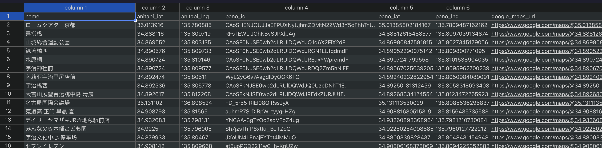
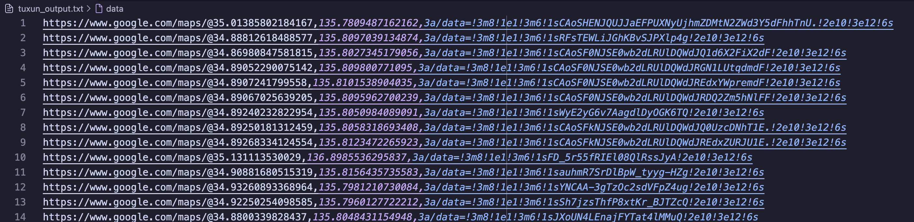
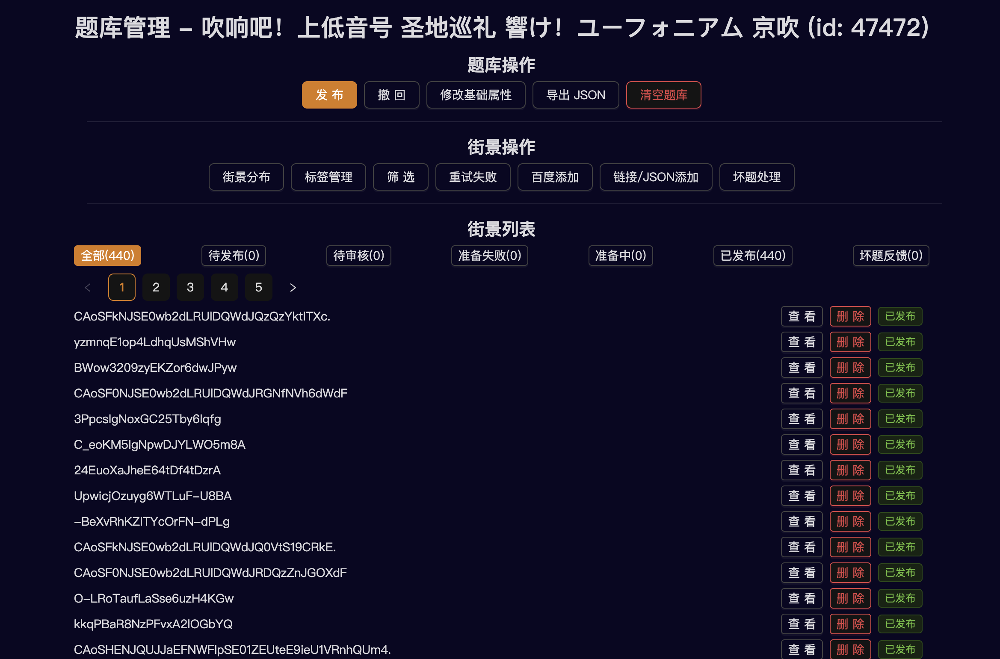

# Anitabi-to-Tuxun

将 Anitabi 上街景导出为图寻题库

## 前置条件

### Google Maps API Key

需要准备`Google Maps API Key`，并获取到需要导出的番剧 ID 列表。

将`.env.example`复制为`.env`，并将其中的`GOOGLE_MAPS_API_KEY`替换为你的 API Key。

### 获取番剧 ID

番剧 ID 可以通过 Anitabi 上的番剧详情页 URL 获取，例如：


修改`main.py`中的`BANGUMI_IDS`列表，填入需要导出的番剧 ID：

```python
BANGUMI_IDS = [115908, 152091, 283643, 216372, 386195, 211089]
```

### 配置 Python 环境

```bash
uv sync
```

## 运行脚本

```bash
uv run main.py
```

## 输出文件

运行完成后，会生成两个文件：

- `output.csv`：包含番剧名称、集数、经纬度、PanoID 等信息的 CSV 文件。
- `tuxun_output.txt`：适用于图寻导入的题库文本文件。

导出的 CSV 文件示例：


导出的图寻题库文本文件示例：


随后将导出的题库文件全部复制到图寻的题库导入页面即可：


导入成功后的效果：



## 注意事项

- 使用本项目时，请确保遵守 Google Maps API 与 Anitabi 与图寻的使用条款。
